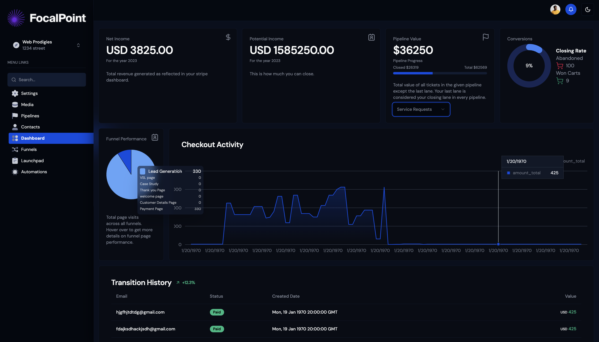

# Stratos - Multi-Tenant SaaS Agency Platform

<div align="center">
  
  <p align="center">
    <strong>A comprehensive SaaS platform designed for digital agencies to manage clients, pipelines, and funnels with precision.</strong>
  </p>
</div>

---

[](https://nextjs.org/)
[](https://www.typescriptlang.org/)
[](https://tailwindcss.com/)
[](https://www.prisma.io/)

## 🚀 Overview

Stratos is a robust, multi-tenant SaaS application built for high-performance agencies. It provides a centralized ecosystem for managing subaccounts, tracking sales through customizable Kanban pipelines, building high-conversion marketing funnels, and managing team collaboration with granular role-based access control.

### ✨ Key Features

- **🏢 Multi-Tenancy**: Built-in subdomain support (e.g., `agency.app.com`) for distinct workspaces.
- **📊 Agency Dashboard**: Comprehensive analytics with financial metrics, client tracking, and Tremor-powered data visualization.
- **🏗️ Pipeline & Kanban**: Drag-and-drop management for sales and project tracking using `react-beautiful-dnd`.
- **🏷️ Ticket & Tag System**: Advanced task management with customer assignment and team delegation.
- **🌪️ Funnel Builder**: Create multi-page marketing funnels with custom subdomain routing.
- **💳 Payment Integration**: Robust subscription management via **Razorpay** (with INR support) and **Stripe**.
- **🔒 Authentication**: Secure user management and onboarding flows powered by **Clerk**.
- **📁 Media Management**: Full CRUD system for file uploads with a searchable card interface.
- **🌓 Modern UI**: Fully responsive design with hydration-safe Dark/Light mode and context-aware navigation.

## 📸 Preview



---

## 🛠️ Tech Stack

- **Framework**: Next.js 15 (App Router)
- **Language**: TypeScript
- **Database**: MariaDB / MySQL (via Prisma ORM)
- **Styling**: Tailwind CSS & Shadcn/UI
- **Auth**: Clerk
- **Payments**: Razorpay & Stripe
- **File Storage**: UploadThing
- **Charts**: Tremor & Recharts
- **Drag & Drop**: React Beautiful DnD

---

## 🏁 Getting Started

### Prerequisites

- Node.js 18+
- npm / pnpm / bun
- MariaDB or MySQL instance

### Installation

1. **Clone the repository**
   ```bash
   git clone https://github.com/your-username/stratos.git
   cd stratos
   ```

2. **Install dependencies**
   ```bash
   bun install
   # or
   npm install
   ```

3. **Environment Setup**
   Create a `.env` file in the root directory and add the required variables:
   ```env
   DATABASE_URL=
   NEXT_PUBLIC_CLERK_PUBLISHABLE_KEY=
   CLERK_SECRET_KEY=
   UPLOADTHING_TOKEN=
   RAZORPAY_KEY_ID=
   RAZORPAY_KEY_SECRET=
   ```

4. **Initialize Database**
   ```bash
   npx prisma generate
   npx prisma migrate dev
   ```

5. **Run the Application**
   ```bash
   npm run dev
   ```

---

## 📁 Project Structure

```
src/
├── app/                  # App Router pages and layouts
│   ├── (main)/           # Authenticated dashboard routes
│   ├── site/             # Public marketing website
│   └── [domain]/         # Dynamic subdomain routing
├── components/           # Reusable UI components (global, site, forms)
├── lib/                  # Backend utilities, queries, and configs
├── providers/            # React Context providers (Modal, Theme)
└── prisma/               # Database schema and migrations
```

---

## 📄 License

This project is licensed under the MIT License - see the [LICENSE](LICENSE) file for details.

<div align="center">
  <p>Built with ❤️ for Agencies</p>
</div>
